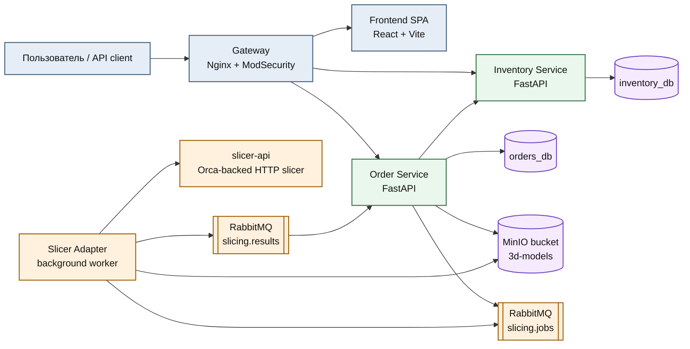
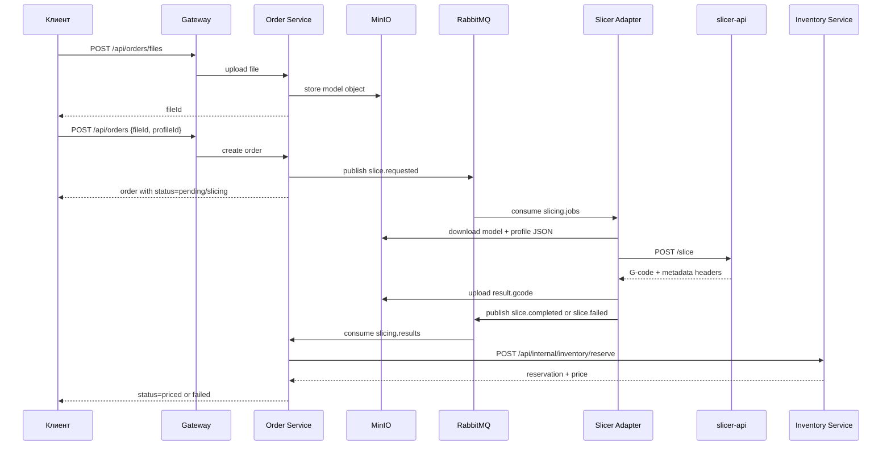
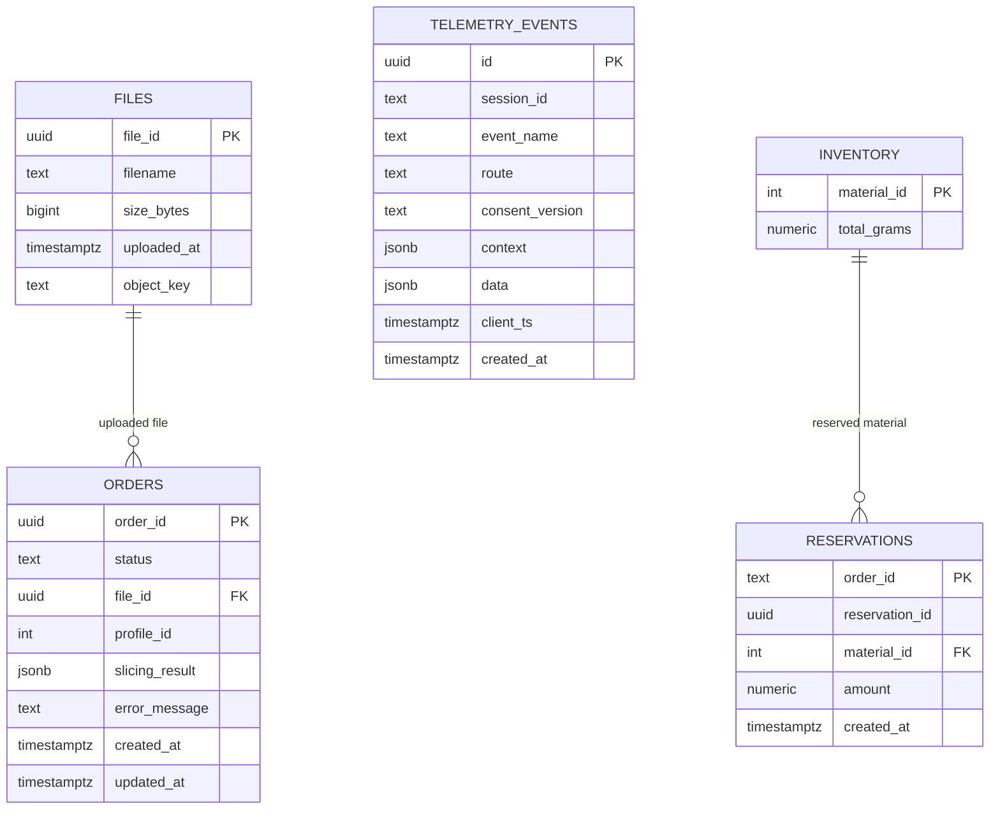

# restful-slice

<p align="center">
  
  
  
  
  
  
  
  
  
  
  
</p>

Платформа для приёма заказов на 3D-печать, асинхронной нарезки моделей, резерва материалов и просмотра статусов в браузере.

## Обзор

`restful-slice` объединяет React-дашборд, два FastAPI-сервиса, воркер нарезки и инфраструктуру для файлов, очередей, БД и деплоя.

Текущий поток такой:

1. Загрузить модель `STL`, `3MF` или `STEP`.
2. Создать заказ с выбранным print profile.
3. Отправить задачу на нарезку через RabbitMQ.
4. Нарезать модель через `slicer-api` / Orca.
5. Сохранить `G-code` в MinIO.
6. Зарезервировать материал и посчитать цену в `inventory-service`.
7. Отдать статус и результат через REST.

## Что лежит в репозитории

- `apps/frontend` - React + Vite дашборд для загрузки моделей, выбора профиля, просмотра заказов, key-scoped identity и отправки телеметрии только после согласия.
- `services/order-service` - приём файлов и заказов, публикация в RabbitMQ, загрузка в MinIO, приём результатов и телеметрии.
- `services/inventory-service` - каталог материалов и профилей, резервирование, pricing.
- `services/slicer-adapter` - воркер, который читает задачи, качает файлы из MinIO, вызывает `slicer-api`, публикует результат.
- `infra/` - локальный Postgres bootstrap, nginx gateway, monitoring, Swarm/Patroni assets и helper scripts.
- `tests/postman` - Postman/Newman коллекции и fixture profiles.
- `docs/` - OpenAPI/AsyncAPI контракты и заметки по проекту.

## Возможности

- Загрузка моделей до `100 MB` через `POST /api/orders/files`.
- Поддержка `STL`, `3MF`, `STEP` и `STP`.
- Создание заказа в два шага: загрузка файла, затем `POST /api/orders` с `profileId`.
- Хранение метаданных файлов и статусов заказов в PostgreSQL.
- Хранение исходников и `G-code` в MinIO.
- Очереди `slicing.jobs` и `slicing.results`.
- Резервирование filament и расчёт финальной цены после успешной нарезки.
- Статусы заказа: `pending`, `slicing`, `priced`, `confirmed`, `printing`, `completed`, `failed`, `cancelled`.
- REST-каталоги профилей и материалов из `inventory-service`.
- Дашборд с автообновлением заказов и выбором профиля перед upload.
- Consent-based telemetry с батчевой отправкой в `order-service`.
- Локальный запуск через `docker compose` и production-like запуск через Docker Swarm.

## Стек

- Backend: `FastAPI`, `Pydantic v2`, `psycopg`, `Alembic`
- Frontend: `React 18`, `TypeScript`, `Vite`, `TanStack Query`
- Очереди: `RabbitMQ`
- Хранилище: `MinIO`
- БД: `PostgreSQL 15`
- Gateway: `Nginx` + `owasp/modsecurity-crs`
- Нарезка: `slicer-api` + Orca Slicer
- CI/CD: `GitHub Actions`, `Newman`, `Trivy`, `Bandit`, `Codecov`
- Прод: `Docker Swarm`, опционально `Patroni` / `Spilo` / `HAProxy`

## Архитектура

Ниже схема по слоям: сначала edge, потом сервисы, потом фоновая нарезка.



## Поток заказа



## Роли сервисов

### Gateway

- Принимает HTTP на порту `80`.
- Проксирует `/api/orders` и `/api/telemetry` в `order_service:8080`.
- Проксирует `/api/inventory` в `inventory_service:8081`.
- Отдаёт SPA и `/assets/*` из frontend-контейнера.
- Добавляет security headers и ModSecurity CRS.

### Frontend

- Одностраничный dashboard для загрузки и мониторинга заказов.
- Использует `TanStack Query` для заказов и профилей.
- Обновляет список заказов каждые `8s`.
- Отправляет telemetry только после явного consent.

### order-service

- Публичный API заказов.
- Сохраняет метаданные файлов и состояние заказов в `orders_db`.
- Загружает модели в MinIO.
- Публикует `slice.requested`.
- Читает `slice.completed` и `slice.failed`.
- После успешной нарезки вызывает внутренний inventory reserve API.
- Пишет telemetry events в PostgreSQL.

### inventory-service

- Даёт read APIs для профилей и материалов.
- Хранит stock и reservations в `inventory_db`.
- Считает цену как `weight_grams * cost_per_gram * markupPercent`.
- Подтверждает или отменяет резервы через internal endpoints.

### slicer-adapter

- Работает как фоновый RabbitMQ consumer.
- Скачивает модель и три JSON-профиля из MinIO.
- Вызывает `slicer-api` по HTTP.
- Проверяет, что ответ похож на `G-code`.
- Загружает `G-code` обратно в MinIO.
- Публикует `slice.completed` или `slice.failed`.

## Модель данных

В репозитории сейчас две отдельные application databases:

- `orders_db` - файлы, заказы, telemetry
- `inventory_db` - stock и reservations

Каталоги профилей, принтеров, материалов и процессов сейчас заданы в коде `inventory-service`, а stock/reservations живут в PostgreSQL.



## Состояния заказа

```text
pending -> slicing -> priced -> confirmed -> printing -> completed
   |          |          |
   |          |          +-> cancelled
   |          +-> failed
   +-> cancelled
```

`confirmed`, `printing` и `completed` уже есть в доменной модели и API-типы тоже это знают, хотя текущий UI в основном живёт вокруг `priced`.

## Структура репозитория

```text
.
├── apps/frontend
├── docs
├── infra
│   ├── monitoring
│   ├── nginx
│   ├── patroni
│   ├── postgres
│   ├── scripts
│   └── terraform
├── services
│   ├── inventory-service
│   ├── order-service
│   ├── slicer-adapter
│   └── tests
└── tests/postman
```

## API

### Public endpoints

- `GET /api/inventory/profiles`
- `GET /api/inventory/profiles/{profileId}`
- `GET /api/inventory/materials`
- `GET /api/inventory/materials/{materialId}`
- `POST /api/orders/files`
- `POST /api/orders`
- `GET /api/orders`
- `GET /api/orders/{orderId}`
- `DELETE /api/orders/{orderId}`
- `POST /api/telemetry/events`
- `GET /api/orders/docs`
- `GET /api/inventory/docs`

### Internal endpoints

- `POST /api/internal/inventory/reserve`
- `PATCH /api/internal/inventory/reservations/{orderId}/status`

### Контракты

- OpenAPI: [docs/endpoints.yml](docs/endpoints.yml)
- AsyncAPI: [docs/asyncapi.yml](docs/asyncapi.yml)

## Локальная разработка

### Что нужно

- `Docker` с Compose plugin
- опционально: `Python 3.11+`
- опционально: `Node.js 22+`
- опционально: `newman`

### `.env`

Compose читает `.env` автоматически.

Главные переменные:

```dotenv
POSTGRES_USER=postgres_admin
POSTGRES_PASSWORD=postgres_secret
POSTGRES_DB=postgres_admin

ORDER_DB_USER=order_svc
ORDER_DB_PASSWORD=order_secret_123
ORDER_DB_NAME=orders_db

INV_DB_USER=inv_svc
INV_DB_PASSWORD=inv_secret_123
INV_DB_NAME=inventory_db

RMQ_USER=rmq_admin
RMQ_PASSWORD=rmq_secret_pass
RABBITMQ_USER=rmq_admin
RABBITMQ_PASSWORD=rmq_secret_pass
RABBITMQ_HOST=rabbitmq
RABBITMQ_PORT=5672

MINIO_ROOT_USER=minioadmin
MINIO_ROOT_PASSWORD=minio_secret_123
MINIO_ENDPOINT=minio:9000
MINIO_BUCKET_NAME=3d-models

POSTGRES_HOST=postgres
POSTGRES_PORT=5432
ORDER_PORT=8080
INVENTORY_PORT=8081
INVENTORY_URL=http://inventory_service:8081
```

### Поднять стек

```bash
docker compose up --build -d
```

После запуска поднимутся:

- `postgres`
- `rabbitmq`
- `minio`
- `order_service`
- `inventory_service`
- `slicer_api`
- `slicer_adapter`
- `frontend`
- `gateway`

### Загрузить fixture profiles

Для happy path в MinIO должны лежать JSON-профили.

```bash
bash infra/scripts/load-fixtures.sh
```

Скрипт зеркалит [tests/postman/fixtures/profiles](tests/postman/fixtures/profiles) в `s3://3d-models/profiles/`.

### Проверка health

- Gateway: `http://localhost/health`
- Gateway internal health: `http://localhost/healthz`
- Order docs: `http://localhost/api/orders/docs`
- Inventory docs: `http://localhost/api/inventory/docs`
- RabbitMQ UI: `http://localhost:15672`
- MinIO console: `http://localhost:9001`

### Только фронтенд

```bash
cd apps/frontend
npm install
VITE_API_BASE_URL=http://localhost npm run dev
```

Поддерживаемые env vars фронтенда:

- `VITE_API_BASE_URL`
- `VITE_ANALYTICS_ENDPOINT`
- `VITE_SENTRY_DSN`
- `VITE_APP_VERSION`

### Локальный запуск сервисов

`docker-compose.override.yml` монтирует исходники для:

- `order_service`
- `inventory_service`
- `slicer_adapter`

Если запускаешь Python-сервис вне Docker, ставь зависимости из его `requirements.txt`.

## Smoke tests

### Ручной happy path

```bash
UPLOAD=$(curl -s -X POST http://localhost/api/orders/files \
  -F "file=@/workspaces/restful-slice/tests/postman/fixtures/cube.stl;type=model/stl")

FILE_ID=$(echo "$UPLOAD" | python3 -c "import sys,json; print(json.load(sys.stdin)['fileId'])")

ORDER=$(curl -s -X POST http://localhost/api/orders \
  -H "Content-Type: application/json" \
  -d "{\"fileId\":\"$FILE_ID\",\"profileId\":3}")

ORDER_ID=$(echo "$ORDER" | python3 -c "import sys,json; print(json.load(sys.stdin)['orderId'])")

for i in $(seq 1 20); do
  sleep 2
  curl -s "http://localhost/api/orders/$ORDER_ID"
  echo
done
```

### Postman / Newman

Основные коллекции:

- [tests/postman/restful-slice-api-e2e.postman_collection.json](tests/postman/restful-slice-api-e2e.postman_collection.json)
- [tests/postman/restful-slice-openapi-contract.postman_collection.json](tests/postman/restful-slice-openapi-contract.postman_collection.json)

Документация:

- [tests/postman/README.md](tests/postman/README.md)

Пример запуска:

```bash
newman run tests/postman/restful-slice-api-e2e.postman_collection.json \
  --environment tests/postman/restful-slice-local.postman_environment.json \
  --env-var "sampleModelPath=/workspaces/restful-slice/tests/postman/fixtures/cube.stl" \
  --env-var "invalidFilePath=/workspaces/restful-slice/tests/postman/fixtures/not-a-model.txt" \
  --folder "Happy path" \
  --delay-request 2000
```

## Автоматизация

В [`.github/workflows/wf_1.yaml`](.github/workflows/wf_1.yaml) настроены:

- unit/integration тесты через `pytest`
- coverage в `Codecov`
- `Bandit` SAST
- Postman/Newman smoke и E2E
- сборка образов
- `Trivy` scan
- push в GHCR на `main`
- Swarm deploy на self-hosted runner

Локальные hooks:

- [`.pre-commit-config.yaml`](.pre-commit-config.yaml)

## Деплой

### Docker Compose

Для локальной интеграции:

```bash
docker compose up --build -d
```

### Docker Swarm

Для кластера используется [docker-stack.yml](docker-stack.yml).

В stack входят:

- replicated `order_service`
- replicated `inventory_service`
- replicated `slicer_api`
- `slicer_adapter`
- `gateway`
- `frontend`
- `rabbitmq`
- `minio`
- bootstrap job для БД

### HA PostgreSQL

Для HA Postgres в репозитории есть отдельный `postgres-ha` stack:

- `Patroni`
- `Spilo`
- `etcd`
- `HAProxy`

См.:

- [infra/patroni/README.md](infra/patroni/README.md)
- [infra/patroni/stack.yml](infra/patroni/stack.yml)

## Monitoring

Есть отдельный swarm stack для мониторинга:

- `Prometheus`
- `Grafana`
- `Loki`
- `Promtail`
- `node-exporter`
- `cAdvisor`

Точка входа:

- [infra/monitoring/docker-stack-monitor.yml](infra/monitoring/docker-stack-monitor.yml)

## Важные детали

- Каталоги профилей, принтеров, материалов и процессов сейчас hard-coded внутри `inventory-service`.
- `order-service` хранит метаданные и состояние, но не бинарники.
- Сценарий end-to-end зависит от fixture profile JSON в MinIO.
- Telemetry идёт только после согласия пользователя и привязывается к API-key identity.
- Gateway открывает один вход на `80:8080` и проксирует SPA и API.

## Ограничения

- Рантайм использует API key как identity boundary; raw key не должен попадать в хранилища.
- Текущий UI больше похож на operator dashboard, чем на customer storefront.
- Логика резерва и каталога намеренно простая и заточена под текущий поток.
- Для локальной проверки проще всего использовать `docker compose`, а Swarm — уже для прод-сценария.

## Связанные документы

- [docs/endpoints.yml](docs/endpoints.yml)
- [docs/asyncapi.yml](docs/asyncapi.yml)
- [docs/assets/architecture.md](docs/assets/architecture.md)
- [services/slicer-adapter/README.md](services/slicer-adapter/README.md)
- [apps/frontend/README.md](apps/frontend/README.md)
- [infra/patroni/README.md](infra/patroni/README.md)

## License

[AGPL-3.0 License](LICENSE)
