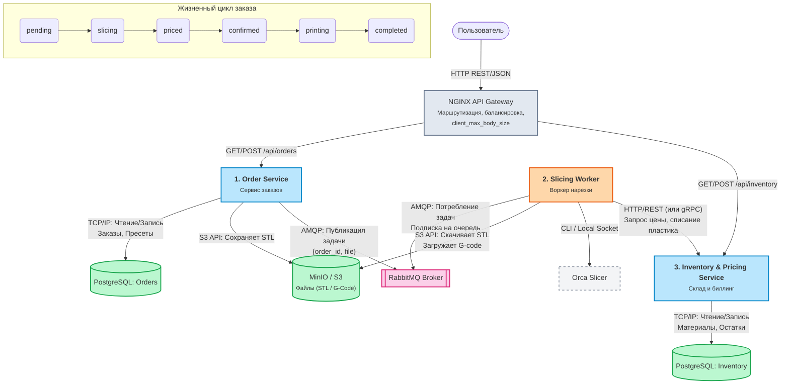

# restful-slice
<p align="center">
  
  
  
  
  
  
  
</p>

<!-- Блок хипстерства (Инструменты, которые делают вид, что код качественный) -->
<p align="center">
  
  
  
</p>

<!-- Блок "Колхоз и Кринж" (То самое жизненное) -->
<p align="center">
  
  
  
  
  
</p>

<!-- Лицензия и Версия -->
<p align="center">
  
  
</p>
<p align="center">
  
  
</p>
<!-- ALL-CONTRIBUTORS-LIST:START - Do not remove or modify this section -->
<!-- prettier-ignore-start -->
<!-- markdownlint-disable -->
<table>
  <tr>
    <td align="center"><a href="https://github.com/github-copilot"><br /><sub><b>GitHub Copilot</b></sub></a><br />🤖</td>
  </tr>
</table>
<!-- markdownlint-enable -->
<!-- prettier-ignore-end -->
<!-- ALL-CONTRIBUTORS-LIST:END -->

### Headless REST application for 3D model processing



## 🧩 Архитектура микросервисов

Проект `restful-slice` (headless-платформа для 3D-печати) состоит из следующих ключевых компонентов:

### 1. Order Service (Сервис заказов)
* **Назначение**: Прием и управление жизненным циклом заказов на 3D-печать.
* **Основные функции**:
  * Загрузка пользовательских STL файлов (сохраняются в S3/MinIO).
  * Создание сущности заказа и привязка к ней выбранного профиля печати (`presetId`).
  * Публикация задач на "нарезку" (slicing) в брокер очередей (RabbitMQ).
  * Выдача статуса готовности заказа клиенту через `/api/orders`.

### 2. Slicer Worker (Воркер нарезки)
* **Назначение**: Фоновый обработчик (consumer), выполняющий тяжелую математическую операцию конвертации 3D-модели в инструкции для принтера.
* **Основные функции**:
  * Чтение задач из очередей RabbitMQ.
  * Скачивание STL-файлов из MinIO.
  * Интеграция с движком **Orca Slicer** для генерации G-code.
  * Подсчет затраченного пластика и времени, взаимодействие с `Inventory Service` для тарификации.
  * Загрузка итогового G-code обратно в MinIO.

### 3. Inventory & Pricing Service (Склад и биллинг)
* **Назначение**: Управление логистикой материалов (филаментов) и ценообразованием.
* **Основные функции**:
  * Хранение базы пластика (цвета, типы, остатки кг).
  * Калькуляция стоимости печати на основе веса сгенерированного G-code.
  * Списание остатков со склада при подтверждении печати `/api/inventory`.

---

## 🚀 Запуск проекта

### Вариант 1 (Рекомендуемый): Быстрый старт через Docker
Весь проект вместе с базами данных (PostgreSQL), брокером сообщений (RabbitMQ) и S3 хранилищем поднимается с помощью Docker Compose.
```bash
# Поднять всю инфраструктуру в фоне
docker-compose up -d

# Посмотреть логи всех сервисов
docker-compose logs -f
