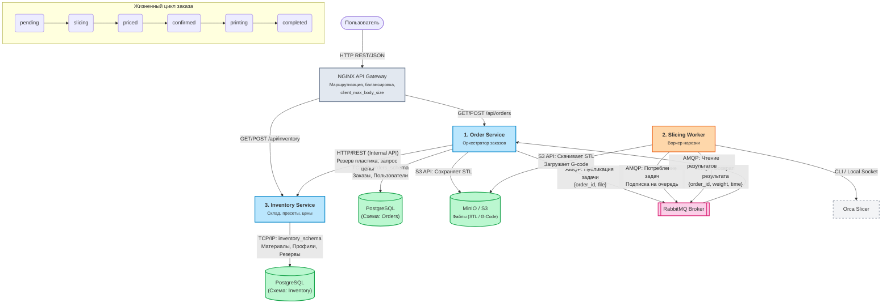
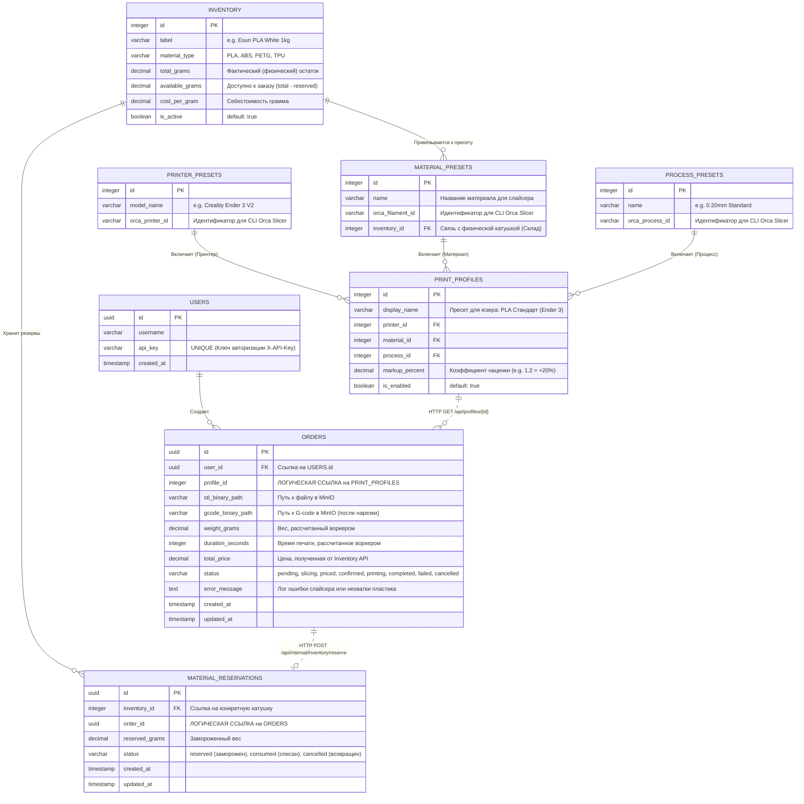

# restful-slice
<p align="center">
  
  
  
  
  
  
  
</p>

<!-- Блок хипстерства (Инструменты, которые делают вид, что код качественный) -->
<p align="center">
  
  
  
</p>

<!-- Блок "Колхоз и Кринж" (То самое жизненное) -->
<p align="center">
  
  
  
  
  
</p>

<!-- Лицензия и Версия -->
<p align="center">
  
  
</p>
<!-- ALL-CONTRIBUTORS-LIST:START - Do not remove or modify this section -->
<!-- prettier-ignore-start -->
<!-- markdownlint-disable -->
<table>
  <tr>
    <td align="center"><a href="https://github.com/github-copilot"><br /><sub><b>GitHub Copilot</b></sub></a><br />🤖</td>
  </tr>
</table>
<!-- markdownlint-enable -->
<!-- prettier-ignore-end -->
<!-- ALL-CONTRIBUTORS-LIST:END -->

### Headless REST application for 3D model processing



## 🧩 Архитектура микросервисов

Проект `restful-slice` (headless-платформа для 3D-печати) состоит из следующих ключевых компонентов. Система построена по принципу оркестрации, где главным управляющим узлом выступает Order Service.

### 1. Order Service (Сервис заказов и Оркестратор)
* **Назначение**: Авторизация пользователей, приём заказов и управление всем их жизненным циклом (Оркестрация бизнес-процесса).
* **Основные функции**:
  * Идентификация клиентов по `X-API-Key`.
  * Прием пользовательских STL файлов (сохраняются в S3/MinIO).
  * Создание сущности заказа и привязка к ней выбранного профиля печати (`profileId`).
  * Публикация задач на "нарезку" (slicing) в брокер очередей (RabbitMQ).
  * **Оркестрация**: Получение результатов от Воркера и вызов внутреннего API (`Internal API`) сервиса склада для резервирования пластика и получения итоговой цены.
  * Выдача текущего статуса заказа клиенту через внешнее API `/api/orders`.

### 2. Slicer Worker (Воркер нарезки)
* **Назначение**: Фоновый, независимый обработчик (stateless consumer). Выполняет исключительно тяжелую математическую операцию конвертации 3D-модели в инструкции для принтера, ничего не зная о бизнес-логике (деньгах, пользователях или складе).
* **Основные функции**:
  * Чтение задач из очередей RabbitMQ.
  * Скачивание исходных STL-файлов из MinIO.
  * Интеграция с движком **Orca Slicer** (через CLI) для генерации G-code.
  * Парсинг логов слайсера для извлечения точного веса затраченного пластика (в граммах) и времени печати.
  * Загрузка итогового G-code обратно в MinIO.
  * **Возврат результатов** нарезки обратно в `Order Service` (через очередь ответов RabbitMQ или внутренний webhook).

### 3. Inventory & Pricing Service (Склад и биллинг)
* **Назначение**: Управление логистикой материалов (филаментов), профилями печати и ценообразованием.
* **Основные функции**:
  * Выдача клиентам списка доступных Профилей Печати (бандл: Принтер + Материал + Настройки качества + Наценка) через внешнее API `/api/inventory/profiles`.
  * Хранение базы физических катушек пластика (цвета, типы, фактические остатки в граммах).
  * **Система резервирования (Internal API)**: По скрытому запросу от `Order Service` проверяет наличие нужного объема пластика, временно "замораживает" (резервирует) его, рассчитывает стоимость печати и возвращает цену оркестратору.
  * Окончательное списание зарезервированного пластика (или возврат на склад при отмене заказа).
 
## ER-диаграмма


## 🚀 Запуск проекта

### Вариант 1 (Рекомендуемый): Быстрый старт через Docker
Весь проект вместе с базами данных (PostgreSQL), брокером сообщений (RabbitMQ) и S3 хранилищем поднимается с помощью Docker Compose.
```bash
# Поднять всю инфраструктуру в фоне
docker-compose up -d

# Посмотреть логи всех сервисов
docker-compose logs -f
```

