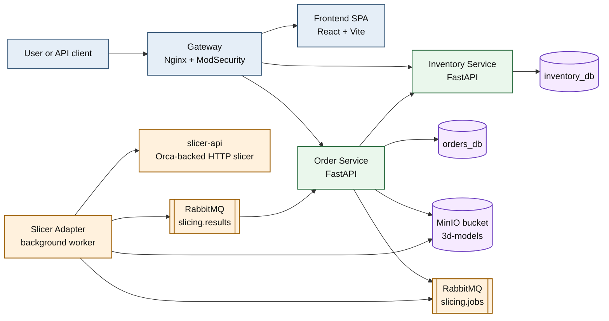
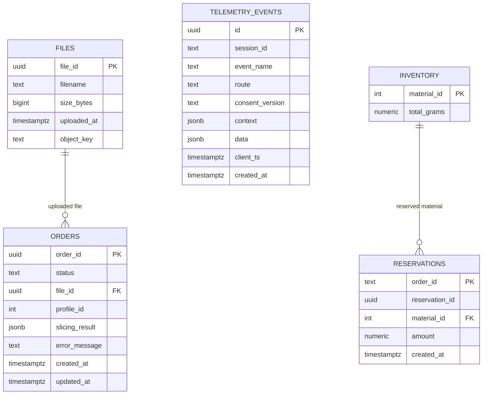

# restful-slice

Headless platform for 3D print order intake, slicing orchestration, material reservation, and lightweight operator visibility.

## Overview

`restful-slice` combines a small React dashboard, two FastAPI business services, an asynchronous slicing worker, and infrastructure for file storage, messaging, and deployment.

The current flow is:

1. Upload a `STL`, `3MF`, or `STEP` model.
2. Create an order with a selected print profile.
3. Send a slicing job through RabbitMQ.
4. Slice the model through `slicer-api` / Orca.
5. Store generated `G-code` in MinIO.
6. Reserve material and calculate price in `inventory-service`.
7. Expose order status and slicing result through REST.

## What The Repository Contains

- `apps/frontend`: React + Vite dashboard for upload, profile selection, order list, and consent-based telemetry.
- `services/order-service`: order intake, file metadata, RabbitMQ publishing, MinIO upload, result consumption, telemetry ingestion.
- `services/inventory-service`: materials catalog API, print profile catalog, stock reservation, pricing.
- `services/slicer-adapter`: worker that consumes slice jobs, downloads assets from MinIO, calls `slicer-api`, uploads `G-code`, publishes results.
- `infra/`: local Postgres bootstrap, Nginx gateway config, monitoring, Swarm/Patroni deployment assets, helper scripts.
- `tests/postman`: versioned Postman/Newman API and E2E collections with fixture profiles.
- `docs/`: OpenAPI/AsyncAPI contracts and project notes.

## Current Capabilities

- Upload model files up to `100 MB` via `POST /api/orders/files`.
- Accept `STL`, `3MF`, `STEP`, and `STP` extensions.
- Create orders through a two-step API: upload file, then create order with `profileId`.
- Persist file metadata and order state in PostgreSQL.
- Store source models and generated `G-code` in MinIO.
- Push slicing requests to `slicing.jobs` and read results from `slicing.results`.
- Reserve filament and calculate final price after successful slicing.
- Track order lifecycle states: `pending`, `slicing`, `priced`, `confirmed`, `printing`, `completed`, `failed`, `cancelled`.
- Expose profile and material catalog APIs from `inventory-service`.
- Provide a browser dashboard with periodic order refresh and profile-driven upload flow.
- Collect client telemetry only after explicit consent, then batch it into `order-service`.
- Run local stacks with `docker compose` and production-like stacks with Docker Swarm.

## Tech Stack

- Backend: `FastAPI`, `Pydantic v2`, `psycopg`, `Alembic`
- Frontend: `React 18`, `TypeScript`, `Vite`, `TanStack Query`
- Messaging: `RabbitMQ`
- Object storage: `MinIO`
- Databases: `PostgreSQL 15`
- Gateway: `Nginx` on top of `owasp/modsecurity-crs`
- Slicing path: `slicer-api` + Orca Slicer
- CI/CD: `GitHub Actions`, `Newman`, `Trivy`, `Bandit`, `Codecov`
- Production deployment: `Docker Swarm`, optional HA Postgres with `Patroni` / `Spilo` / `HAProxy`

## System Architecture

The architecture is easier to read if you separate it into three lanes: entry layer, business layer, and async slicing layer.



## Order Processing Flow


## Service Responsibilities

### Gateway

- Terminates HTTP on port `80`.
- Proxies `/api/orders` and `/api/telemetry` to `order_service:8080`.
- Proxies `/api/inventory` to `inventory_service:8081`.
- Proxies `/` and `/assets/*` to the frontend container.
- Includes security headers and ModSecurity CRS.

### Frontend

- Single-page dashboard for upload and order monitoring.
- Uses `TanStack Query` for profile and order fetching.
- Polls the order list every `8s`.
- Sends consent-gated telemetry batches to `/api/telemetry/events`.

### order-service

- Hosts the public order API.
- Saves file metadata and order state in `orders_db`.
- Uploads model binaries to MinIO.
- Publishes `slice.requested`.
- Consumes `slice.completed` and `slice.failed`.
- Calls the internal inventory reservation endpoint after successful slicing.
- Stores telemetry events in PostgreSQL.

### inventory-service

- Exposes read APIs for print profiles and materials.
- Tracks physical stock and active reservations in `inventory_db`.
- Calculates price as `weight_grams * cost_per_gram * markupPercent`.
- Confirms or cancels reservations through internal endpoints.

### slicer-adapter

- Runs a background RabbitMQ consumer.
- Downloads the model and three profile JSON files from MinIO.
- Calls `slicer-api` over HTTP.
- Validates that the response body is actual `G-code`.
- Uploads generated `G-code` to MinIO.
- Publishes either `slice.completed` or `slice.failed`.

## Data Model

The repository currently uses two separate application databases:

- `orders_db` for files, orders, telemetry
- `inventory_db` for stock and reservations

Profile, material, printer, and process catalogs are currently defined in code inside `inventory-service`, while stock and reservations are persisted in PostgreSQL.



## Domain State Model

```text
pending -> slicing -> priced -> confirmed -> printing -> completed
   |          |          |
   |          |          +-> cancelled
   |          +-> failed
   +-> cancelled
```

`confirmed`, `printing`, and `completed` already exist in the domain model and API types, even though the current UI flow is centered around `priced`.

## Repository Layout

```text
.
├── apps/frontend
├── docs
├── infra
│   ├── monitoring
│   ├── nginx
│   ├── patroni
│   ├── postgres
│   ├── scripts
│   └── terraform
├── services
│   ├── inventory-service
│   ├── order-service
│   ├── slicer-adapter
│   └── tests
└── tests/postman
```

## API Surface

### Public endpoints

- `GET /api/inventory/profiles`
- `GET /api/inventory/profiles/{profileId}`
- `GET /api/inventory/materials`
- `GET /api/inventory/materials/{materialId}`
- `POST /api/orders/files`
- `POST /api/orders`
- `GET /api/orders`
- `GET /api/orders/{orderId}`
- `DELETE /api/orders/{orderId}`
- `POST /api/telemetry/events`
- `GET /api/orders/docs`
- `GET /api/inventory/docs`

### Internal endpoints

- `POST /api/internal/inventory/reserve`
- `PATCH /api/internal/inventory/reservations/{orderId}/status`

### Contracts

- OpenAPI summary: [docs/endpoints.yml](/workspaces/restful-slice/docs/endpoints.yml)
- AsyncAPI summary: [docs/asyncapi.yml](/workspaces/restful-slice/docs/asyncapi.yml)

## Local Development

### Prerequisites

- `Docker` with Compose plugin
- optional: `Python 3.11+`
- optional: `Node.js 22+`
- optional: `newman` for Postman-based smoke tests

### Environment

The repository expects a local `.env` file. Compose reads it automatically.

The important variables are:

```dotenv
POSTGRES_USER=postgres_admin
POSTGRES_PASSWORD=postgres_secret
POSTGRES_DB=postgres_admin

ORDER_DB_USER=order_svc
ORDER_DB_PASSWORD=order_secret_123
ORDER_DB_NAME=orders_db

INV_DB_USER=inv_svc
INV_DB_PASSWORD=inv_secret_123
INV_DB_NAME=inventory_db

RMQ_USER=rmq_admin
RMQ_PASSWORD=rmq_secret_pass
RABBITMQ_USER=rmq_admin
RABBITMQ_PASSWORD=rmq_secret_pass
RABBITMQ_HOST=rabbitmq
RABBITMQ_PORT=5672

MINIO_ROOT_USER=minioadmin
MINIO_ROOT_PASSWORD=minio_secret_123
MINIO_ENDPOINT=minio:9000
MINIO_BUCKET_NAME=3d-models

POSTGRES_HOST=postgres
POSTGRES_PORT=5432
ORDER_PORT=8080
INVENTORY_PORT=8081
INVENTORY_URL=http://inventory_service:8081
```

### Start The Full Local Stack

```bash
docker compose up --build -d
```

Services started by default:

- `postgres`
- `rabbitmq`
- `minio`
- `order_service`
- `inventory_service`
- `slicer_api`
- `slicer_adapter`
- `frontend`
- `gateway`

### Load Slicer Profile Fixtures

The happy path requires profile JSON fixtures to exist in MinIO.

```bash
bash infra/scripts/load-fixtures.sh
```

This mirrors [tests/postman/fixtures/profiles](/workspaces/restful-slice/tests/postman/fixtures/profiles) into `s3://3d-models/profiles/`.

### Health Checks

- Gateway: `http://localhost/health`
- Gateway internal health: `http://localhost/healthz`
- Order docs: `http://localhost/api/orders/docs`
- Inventory docs: `http://localhost/api/inventory/docs`
- RabbitMQ UI: `http://localhost:15672`
- MinIO console: `http://localhost:9001`

### Local Frontend-Only Development

```bash
cd apps/frontend
npm install
VITE_API_BASE_URL=http://localhost npm run dev
```

Supported frontend env vars:

- `VITE_API_BASE_URL`
- `VITE_ANALYTICS_ENDPOINT`
- `VITE_SENTRY_DSN`
- `VITE_APP_VERSION`

### Local Service Development

Compose override mounts the source directories for:

- `order_service`
- `inventory_service`
- `slicer_adapter`

For pure Python runs outside Docker, use each service directory and install its `requirements.txt`.

## Smoke Testing

### Quick Manual Happy Path

```bash
UPLOAD=$(curl -s -X POST http://localhost/api/orders/files \
  -F "file=@/workspaces/restful-slice/tests/postman/fixtures/cube.stl;type=model/stl")

FILE_ID=$(echo "$UPLOAD" | python3 -c "import sys,json; print(json.load(sys.stdin)['fileId'])")

ORDER=$(curl -s -X POST http://localhost/api/orders \
  -H "Content-Type: application/json" \
  -d "{\"fileId\":\"$FILE_ID\",\"profileId\":3}")

ORDER_ID=$(echo "$ORDER" | python3 -c "import sys,json; print(json.load(sys.stdin)['orderId'])")

for i in $(seq 1 20); do
  sleep 2
  curl -s "http://localhost/api/orders/$ORDER_ID"
  echo
done
```

### Postman / Newman

Main collections:

- [tests/postman/restful-slice-api-e2e.postman_collection.json](/workspaces/restful-slice/tests/postman/restful-slice-api-e2e.postman_collection.json)
- [tests/postman/restful-slice-openapi-contract.postman_collection.json](/workspaces/restful-slice/tests/postman/restful-slice-openapi-contract.postman_collection.json)

Documentation:

- [tests/postman/README.md](/workspaces/restful-slice/tests/postman/README.md)

Example run:

```bash
newman run tests/postman/restful-slice-api-e2e.postman_collection.json \
  --environment tests/postman/restful-slice-local.postman_environment.json \
  --env-var "sampleModelPath=/workspaces/restful-slice/tests/postman/fixtures/cube.stl" \
  --env-var "invalidFilePath=/workspaces/restful-slice/tests/postman/fixtures/not-a-model.txt" \
  --folder "Happy path" \
  --delay-request 2000
```

## Automated Checks

Configured in [`.github/workflows/wf_1.yaml`](/workspaces/restful-slice/.github/workflows/wf_1.yaml):

- unit and integration tests with `pytest`
- coverage upload to `Codecov`
- `Bandit` SAST
- Postman/Newman smoke and E2E runs
- image builds for all deployable components
- `Trivy` vulnerability and secret scanning
- GHCR image publishing on `main`
- Swarm deployment on a self-hosted runner

Local hooks:

- [`.pre-commit-config.yaml`](/workspaces/restful-slice/.pre-commit-config.yaml)

## Deployment Modes

### Docker Compose

Use for local integration and development:

```bash
docker compose up --build -d
```

### Docker Swarm

Use [docker-stack.yml](/workspaces/restful-slice/docker-stack.yml) for cluster deployment.

The stack includes:

- replicated `order_service`
- replicated `inventory_service`
- replicated `slicer_api`
- `slicer_adapter`
- `gateway`
- `frontend`
- `rabbitmq`
- `minio`
- bootstrap job for databases

### HA PostgreSQL

For production-grade Postgres HA, the repo includes a separate `postgres-ha` stack with:

- `Patroni`
- `Spilo`
- `etcd`
- `HAProxy`

See:

- [infra/patroni/README.md](/workspaces/restful-slice/infra/patroni/README.md)
- [infra/patroni/stack.yml](/workspaces/restful-slice/infra/patroni/stack.yml)

## Monitoring

The repo also contains a Swarm monitoring stack with:

- `Prometheus`
- `Grafana`
- `Loki`
- `Promtail`
- `node-exporter`
- `cAdvisor`

Entry point:

- [infra/monitoring/docker-stack-monitor.yml](/workspaces/restful-slice/infra/monitoring/docker-stack-monitor.yml)

## Important Implementation Notes

- Profile, printer, process, and material catalogs are currently hard-coded inside `inventory-service`; only stock and reservations are persisted.
- `order-service` stores metadata and state, but not binary files; binaries live in MinIO.
- The end-to-end slicing path depends on fixture profile JSON existing in MinIO.
- Telemetry is opt-in on the frontend and lands in the `telemetry_events` table through `order-service`.
- The gateway publishes `80 -> 8080` and routes the SPA and APIs from one entrypoint.

## Known Boundaries

- No authentication or authorization is currently enforced in the running code, even though older docs mention API keys.
- The current UI is an operator-style dashboard, not a customer storefront.
- Reservation and catalog logic are intentionally simple and optimized for the current integration flow.
- Swarm deployment assets are more advanced than the local runtime model; local Compose remains the easiest way to validate the system.

## Related Docs

- [docs/endpoints.yml](/workspaces/restful-slice/docs/endpoints.yml)
- [docs/asyncapi.yml](/workspaces/restful-slice/docs/asyncapi.yml)
- [docs/assets/architecture.md](/workspaces/restful-slice/docs/assets/architecture.md)
- [services/slicer-adapter/README.md](/workspaces/restful-slice/services/slicer-adapter/README.md)
- [apps/frontend/README.md](/workspaces/restful-slice/apps/frontend/README.md)
- [infra/patroni/README.md](/workspaces/restful-slice/infra/patroni/README.md)

## License

[BSD License](/workspaces/restful-slice/LICENSE)
