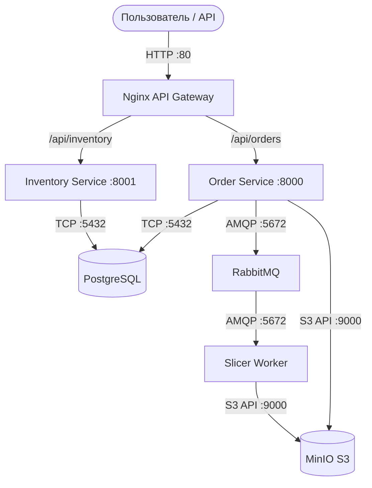

```mermaid
graph TD
    User([Пользователь / API]) -->|HTTP :80| Nginx[Nginx API Gateway]

    Nginx -->|/api/orders| OrderSvc[Order Service :8000]
    Nginx -->|/api/inventory| InvSvc[Inventory Service :8001]

    OrderSvc -->|TCP :5432| DB[(PostgreSQL)]
    InvSvc -->|TCP :5432| DB

    OrderSvc -->|S3 API :9000| MinIO[(MinIO S3)]
    SlicerSvc[Slicer Worker] -->|S3 API :9000| MinIO

    OrderSvc -->|AMQP :5672| RMQ[RabbitMQ]
    RMQ -->|AMQP :5672| SlicerSvc
```
